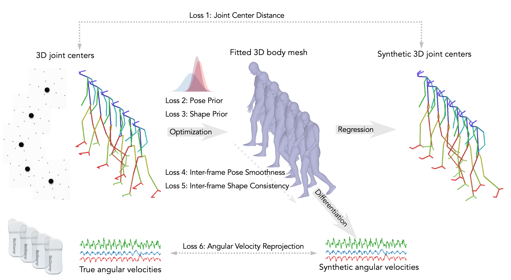

# CMU_PanopticDataset_2.0

Official code repository for the paper: <br>
**Toward Portable and Modular Biomechanics Labs: How Video and IMU Fusion Will Change Gait Analysis**  
Eni Halilj*, Soyong Shin, Eric Rapp, Donglai Xiang  
Journal of Biomechanics, 2021  
  

  
<br><br>
## Installation  

All programming package is **only** tested on Ubuntu 20.04 and CUDA 11.2 with python 3.8.
In this installation section, we assume you are using the proper system.

### Step 1. Clone the repository  
`git clone https://github.com/CMU-MBL/CMU_PanopticDataset_2.0.git <PATH>`

### Step 2. Install dependencies  
We recommend to use [Anaconda](https://anaconda.org/) virtual environment with `python3` for running demo of this repository. 
All dependencies can be installed by following commands:
```
conda create -n Panoptic python=3
conda activate Panoptic
pip install -r requirements.txt
conda install -c conda-forge ffmpeg
```

### Step 3. Download Dataset
We have published CMU_Panoptic_Dataset_2.0 at [SimTK-project-page](https://simtk.org/projects/cmupanopticdata)). 
Following the guideline of SimTK data share, you can download the dataset in your local machine.
Once you download all data and extract the .zip files, you need to make a soft link of the dataset to the repository.
```
mkdir data
ln -s <DATASET PATH> ./data/
```

### Step 4. Download relevant files for SMPL model
In order to run optimization fitting on 3D body model, you need to download few files as below:
1. SMPL model  
    *SMPL_MALE.pkl*, *SMPL_FEMALE.pkl*, *SMPL_NEUTRAL.pkl*  
    Can be found on the [SMPL-Official-Homepage](https://smpl.is.tue.mpg.de/).
    <br><br>
2. SMPL regression matrix  
    *SMPLCOCORegressor.npy*  
    Can be downloaded by here<br><br>
3. SMPL mean parameters and Gaussian pose prior  
    *smpl_mean_params.npz*  *gmm08.pkl*
    Visit [SPIN-Official-Repository](https://github.com/nkolot/SPIN) and get those files by fetching data.

Then place those files as following structure:
```
<REPO DIR> -- data\ -- body_models\ -- smpl\ -- SMPL_MALE.pkl, SMPL_FEMALE.pkl, SMPL_NEUTRAL.pkl
                                    -- SMPLCOCORegressor.npy
                                    -- smpl_mean_params.npz
                                    -- gmm_08.pkl
```


## Run demo fitting
Demo fitting can be simply computed by running `run_fitting.py`. We provide basic options for fitting algorithm in `utils/fitting_options.py`.
Following the namespace of parsing arguments, you can run your own fitting.

One example is:  
`python run_fitting.py --subject 'S01' --activity 'walking_direction1' --viz-results`

This will run optimization on Subject *S01* with *walking_direction1* activity and save video of SMPL mesh results.
